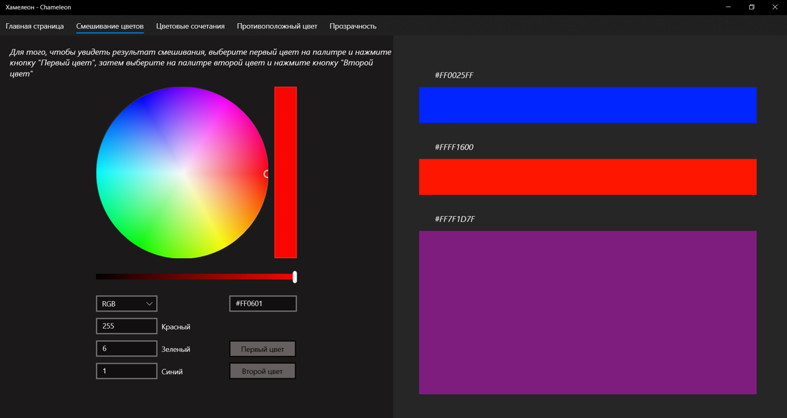
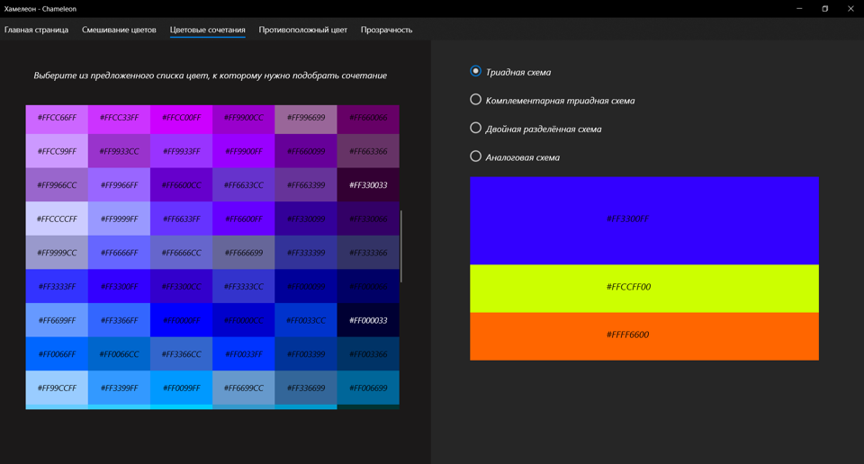
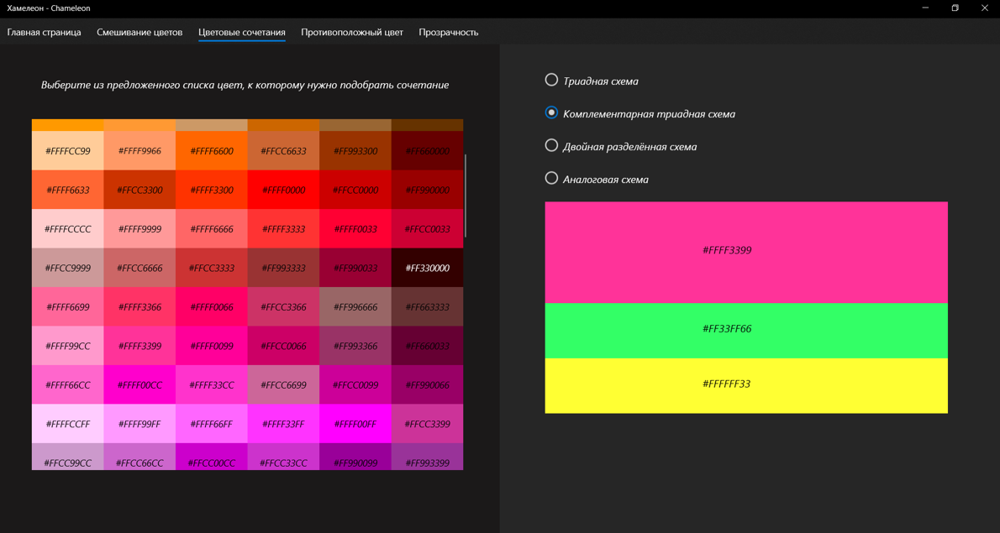
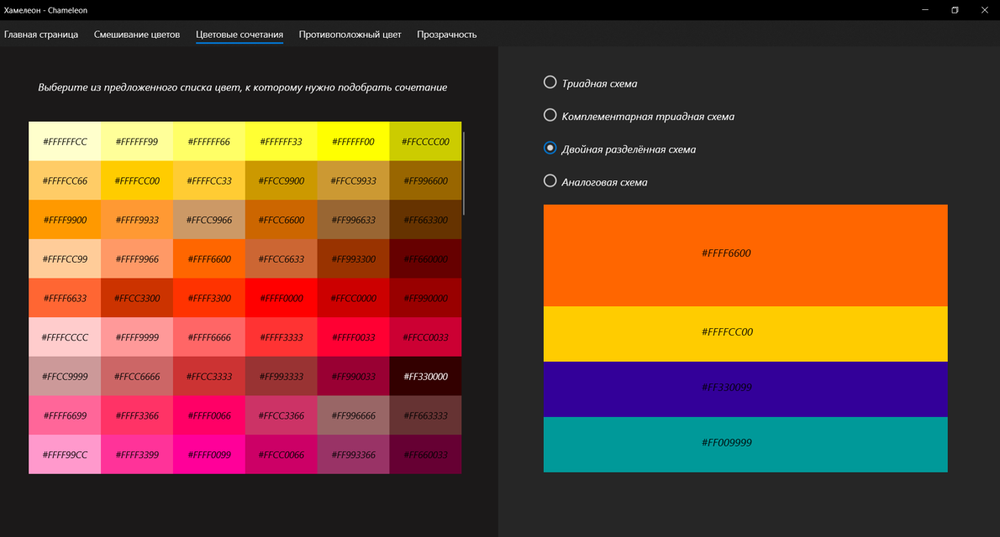
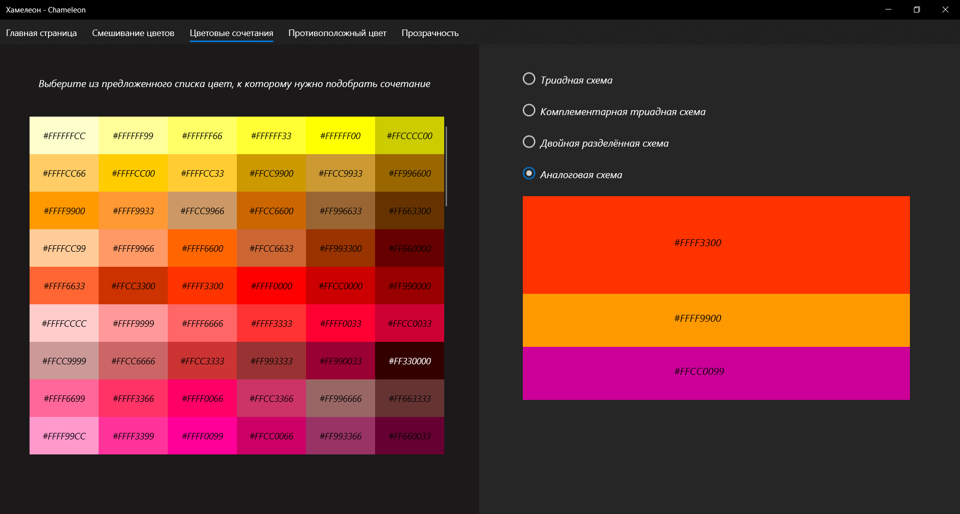
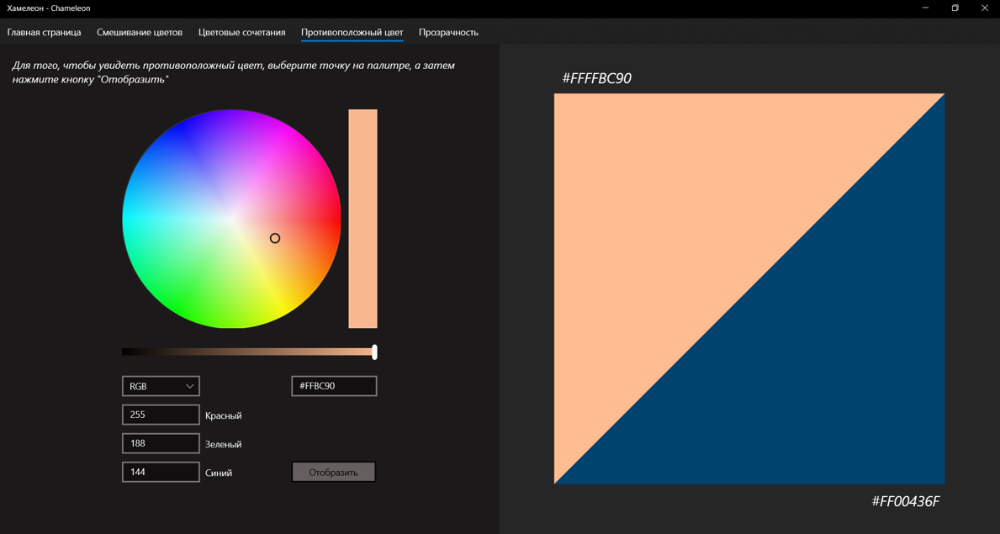
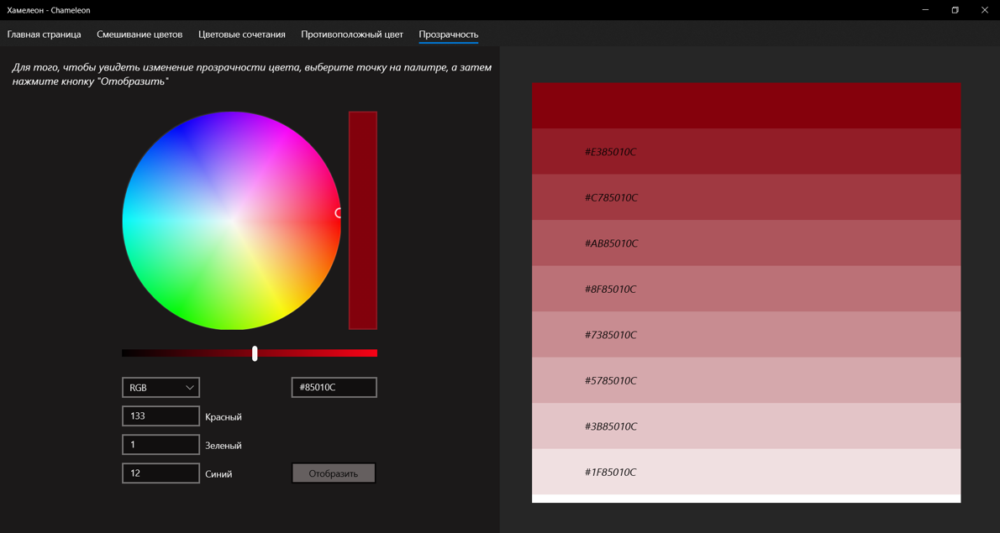

# Color Matching Application "Chameleon"
## Сolor mixing

## Color combinations
Web safe colors are formed by the combination of red, green and blue (RGB) hex values of 00, 33, 66, 99, CC, FF. This results with 6x6x6 = 216 colors.  
  
Classic triadic - three colors spaced equaly apart on the color wheel.

##
Split complement - a color and the two colors next to its complement on the color wheel.

##
Double complementary - colors opposite each other on the color wheel.

##
Analogous - colors that are adjacent to each other on the color wheel.

## Opposite color

## Transparency

